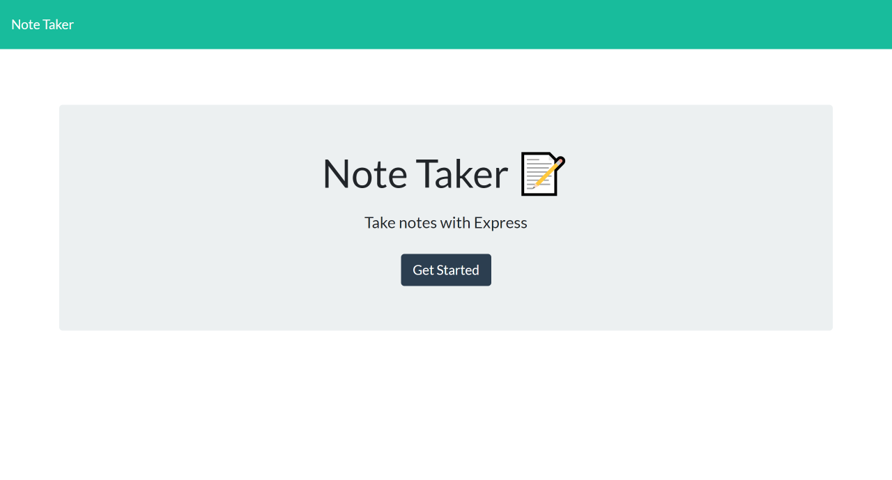
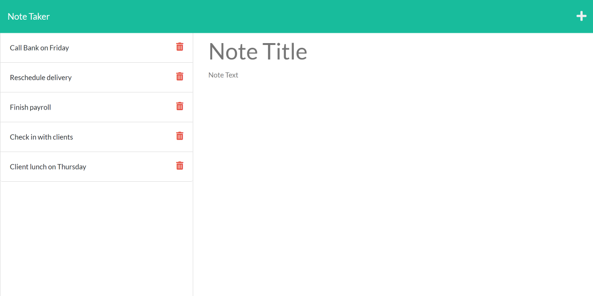
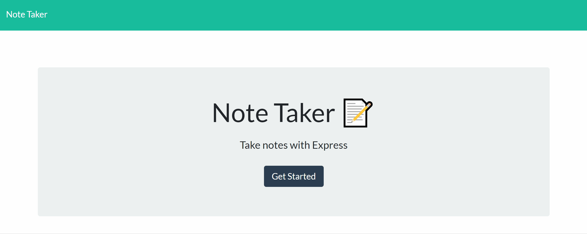

# Note-Taker

## Description

Note taker is a browser-based note taking application when opened then presented with a landing page with a link to a notes page.When user click on the link to the notes page then they are presented with a page with existing notes listed in the left-hand column.When user enter a new note title and the note’s text then a Save icon appears in the navigation at the top of the page when the Save icon is clicked, then the new note entered is saved and appears in the left-hand column with the other existing notes.
When user clicked on an existing note in the list in the left-hand column, then that note appears in the right-hand column which cannot be modified. When user click on plus icon in the navigation at the top of the page then user is presented with empty fields to enter a new note title and the note’s text in the right-hand column.
This application uses an Express.js back end and will save and retrieve note data from a JSON file.

## Key Learning:

1. Javascript.
2. Node.js
3. NPM packages express.js, nodemon , uuid
4. Usage of Github (uploading and publishing on github).

## Table of Contents

- [Installation](#Installation)
- [Usage](#Usage)
- [License](#License)
- [Contributors](#Contributors)
- [Tests](#Tests)
- [Technologies](#Technologies)
- [Questions](#Questions)

## Installation

- Clone project into a local directory and cd into note-taker directory.
- On console run npm install. It will install express,nodemon, and uuid packages.
- Run the command node server.js and verify server start message in console.
- Navigate to port 3001 of your localhost to use application locally.

## Usage

- Homepage Screenshot

  

- Notes Page Screenshot with some saved notes

  

- Mockup

  

- Deployed Link at Heroku

  [View App Here](https://agile-beyond-18161.herokuapp.com/)

## License

- The application is covered under the license MIT. For more Info please visit [License Info](https://opensource.org/licenses/MIT)

## Contributors

- None

## Tests

- None

## Technologies

- Node.js
- Express.js
- npm pakages( uuid,nodemon,express.js)
- HTML,CSS,JavaScript
- Bootstrap CSS Framework

## Questions

If you have any questions about project you can either contact me or visit my github profile.

Link to my Github: [Github](https://github.com/gunjanb)

Email address :[gunjanbhargava2021@gmail.com](mailto:gunjanbhargava2021@gmail.com)
